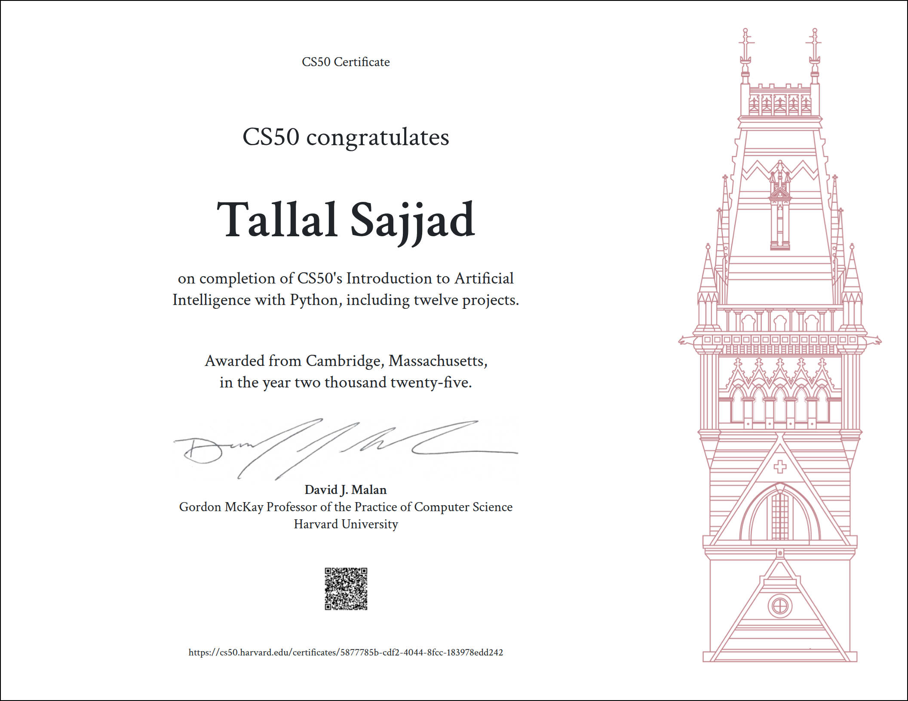

# CS50AI — Introduction to Artificial Intelligence with Python

<!-- 1. Harvard Logo -->

  

<!-- 2. Course Explanation -->
**CS50AI** is Harvard University’s course on artificial intelligence.  
It explores the foundational concepts and algorithms that enable modern AI, covering search, knowledge representation, reasoning, optimization, machine learning, neural networks, and natural language processing.  
All projects are implemented in **Python** with a focus on problem-solving and practical applications.

<!-- 3. Certificate -->
## 🎓 Certificate

  

<!-- 4. Problem Sets -->
## 📂 Problem Sets

### Week 0 — Search
- [Degrees](Project-0/degrees/degrees.py)  
- [Tic-Tac-Toe](Project-0/tictactoe/tictactoe.py)  

### Week 1 — Knowledge
- [Knights](Project-1/knights/knights.py)  
- [Minesweeper](Project-1/minesweeper/minesweeper.py)  

### Week 2 — Uncertainty
- [PageRank](Project-2/pagerank/pagerank.py)  
- [Heredity](Project-2/heredity/heredity.py)  

### Week 3 — Optimization
- [Crossword](Project-3/crossword/crossword.py)  

### Week 4 — Learning
- [Shopping](Project-4/shopping/shopping.py)  
- [Nim](Project-4/nim/nim.py)  

### Week 5 — Neural Networks
- [Traffic](Project-5/traffic/traffic.py)  

### Week 6 — Language
- [Parser](Project-6/parser/parser.py)  
- [Attention](Project-6/attention/mask.py)  

---
